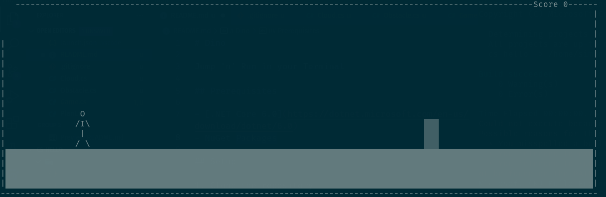

# Dino

Jump 'n' Run in your terminal



## About

Dino is inspired by [Chrome Dino Game](https://chromedino.com/). But instead of a dino the main player is a person (mainly due to the lack of creativity and also copyright issues :D).

The controls are rather simple:

- `space` to jump
- `esc` to exit

## Prerequisites

- [.NET Core 6.0](https://dotnet.microsoft.com/en-us/download/dotnet/6.0)

## Setup

1. Clone the repository

```sh
git clone https://github.com/simonkoeck/dino.git && cd dino
```

2. Restore/install packages

```sh
dotnet restore
```

3. Run the game

```sh
dotnet run
```

## Building

```sh
dotnet build --configuration Release
```

After running this command, an executable should be built to `bin/Release/`.

See https://docs.microsoft.com/en-us/dotnet/core/tools/dotnet-build for more details.

## Supported Platforms

Dino is available for

- `Windows`
- `Linux`
- `Mac`

As long as your platform is supported by .NET, you can build dino.

## Behind the scenes

Dino's whole game is rendered inside a console (System.Console Namespace). Due to performance issues, only the objects which are updated will be rerendered. Rendering is done using `Console.SetCursorPosition` function.

The game difficulty is based on the score and decreases the obstacle instantiation timeout, which makes the game faster and harder.

## Contributing

Every contribution is welcome! Please commit any pull requests against the `main` branch.
